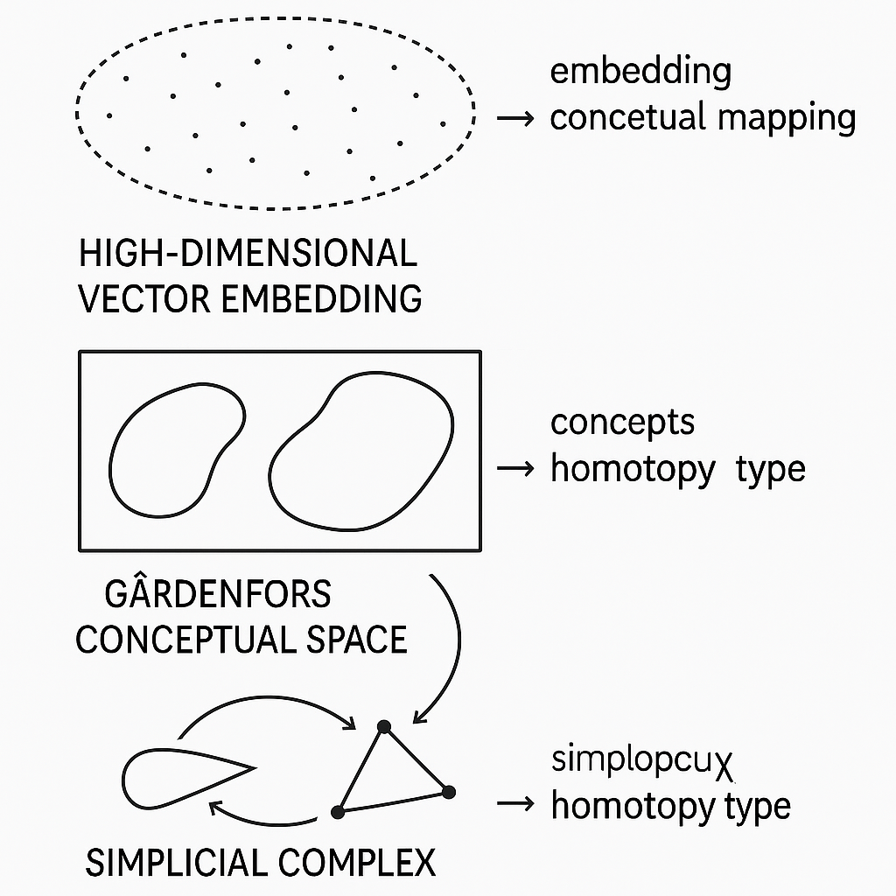

# Towards Homotopy-Aware Neural Representations

>  "Deep Homotopical Conceptual Geometry"

Deep neural networks project the world into vast numerical “clouds.”  While this embedding geometry supports impressive prediction, its axes are not the semantic dimensions that philosophers and cognitive scientists would call *concepts*.  Recent advances in conceptual spaces [^1][^2], category theory-based learning [^3][^4][^5], homotopy type theory [^6][^7], and topology-guided optimization [^8][^9][^10] reveal a path toward representations that are both trainable **and** interpretable.

Below we synthesize these threads, show why stochastic gradient descent (SGD) need not be abandoned, and outline concrete research directions for learning **homotopy representations**—structures whose algebraic shape varies continuously yet captures Gardenfors-style concept regions.

## 1. Why Current Embeddings Fall Short

### 1.1 Distributed Superposition

- Parameters in large language models (LLMs) simultaneously encode thousands of weak features, causing “superposition” where unrelated meanings overlap [^11][^12].
- Linear probes recover some directions, but interpretability degrades as network width grows, echoing the “curse of dimensional analogies” Kenneth Stanley highlights when SGD chases deceptive objectives [^13][^14].

### 1.2 Missing Cognitive Geometry

- Gardenfors’ **conceptual spaces** model concepts as convex regions in low-dimensional metric manifolds of perceptual qualities [^1][^15].
- A single vector coordinate in an LLM rarely aligns with one such quality dimension; thus convexity, betweenness, and prototype distance—the hallmarks of human generalization—are lost [^16][^17].

## 2. Mathematical Lenses for Meaning

### 2.1 Category Theory Optics

- Backpropagation can be recast as a *functor* between categories of parameterized maps and learning rules, ensuring compositional gradients [^4][^5].
- Categorical deep learning libraries already express convolution, attention, and gradient flow via string diagrams, making the algebra of learning explicit [^18].

### 2.2 Homotopy & Topology

- **Homotopy** treats two shapes as equivalent if they deform into each other continuously.  Persistent homology tracks how connected components, tunnels, and voids appear across scales, giving a multiresolution signature of data geometry [^8][^9][^19].
- Neural persistent-losses (e.g., topological autoencoders and connectivity-optimized AEs) incorporate barcodes into SGD, preserving manifold connectivity in latent space [^10][^20].

### 2.3 Conceptual Spaces Meet Homotopy

- A Concept region is naturally a *convex polytope* in a conceptual space.
- As categories, these regions form an ∞-groupoid; their morphisms are deformations preserving prototypes.
- Training that respects these morphisms yields embeddings where “oak” can smoothly morph into “tree” without crossing conceptual barriers.

## 3. Can We Learn Such Representations with SGD?

### 3.1 Homotopy-Guided Objectives

1. **Topology-aware regularizers**: add losses that penalize unwanted births/deaths of homology classes between mini-batches [^9][^21].
2. **Homotopy training algorithms (HTA)**: start from linear nets and continuously warp activations toward non-linear targets, following a provably convergent path [^22][^23][^24].
3. **Ease-in-Ease-out fine-tuning** across homotopy classes: curriculum schedules that relax barrier penalties then re-introduce them, allowing policies to cross topology gaps safely [^25][^26].

### 3.2 Practical Pipeline

| Stage                   | Tool                                                    | Purpose                                        |
|:----------------------- |:------------------------------------------------------- |:---------------------------------------------- |
| Prototype extraction    | Unsupervised clustering in embedding space              | Initial Gardenfors regions                     |
| Homotopy loss           | Persistent barcode distance between prototype complexes | Maintain topological equivalence across layers |
| Category-aware gradient | Functorial backprop (Backprop-as-Functor)               | Ensure compositional updates respect morphisms |
| Curriculum              | HTA or Ease-in schedules                                | Prevent deceptive minima noted by Stanley      |

SGD remains the engine, but gradients now flow through *differentiable topology* modules and category-theoretic layers, guiding weight updates toward semantically convex, homotopy-stable encodings.

## 4. Early Empirical Signs

### 4.1 Topological Autoencoders

Latent manifolds preserve connectedness of inputs; downstream density estimators gain robustness in low-sample regimes [^20].

### 4.2 Grid-Cell–Inspired Representations

Continuous attractor networks can store multiple spatial maps, showing that neural populations can represent several conceptual spaces concurrently via homotopy classes [^27][^28].

### 4.3 Transfer RL Across Homotopy Classes

Policies fine-tuned with homotopy-aware curricula adapt across reward landscapes that are otherwise non-transferable [^25].

## 5. Open Research Agenda

1. **Differentiable Conceptual Spaces**
   - Embed Gardenfors dimensions (color hue, taste, force) as learnable coordinate charts; enforce convexity via interior-point losses.
2. **Functorial Transformers**
   - Re-implement attention as a monoidal functor to guarantee interpretability of composed layers.
3. **Persistent-Homology Tokens**
   - Attach persistence diagrams to token sequences, allowing LLMs to reason over shape information explicitly.
4. **Homotopy Type Layers**
   - Use homotopy type theory as a static type system for neural programs, ensuring equivalence of differently-ordered computations.

## 6. Conclusion

Yes—homotopy representations *can* be learned.  By marrying:

- Gardenfors’ convex conceptual geometry,
- Category theory’s compositional semantics, and
- Topology’s machinery for tracking continuous deformation,

we gain a principled roadmap for embeddings whose algebraic shape mirrors conceptual meaning and supports human-scale reasoning.  The challenge is not the capacity of SGD, but the *objective landscape* we paint for it.  With topology-aware losses and categorical architectures, the path to interpretable, homotopy-rich neural knowledge is open.

Mapping from vector embeddings to conceptual spaces and onward to homotopy-type representations.

⁂

[^1]: https://en.wikipedia.org/wiki/Conceptual_space

[^2]: https://www.barnesandnoble.com/w/the-geometry-of-meaning-peter-gardenfors/1118741226

[^3]: https://arxiv.org/pdf/1707.02292.pdf

[^4]: https://cs.nyu.edu/faculty/davise/commonsense01/final/Gardenfors.pdf

[^5]: https://www.porchlightbooks.com/products/geometry-of-meaning-peter-gardenfors-9780262533751

[^6]: https://www.lunduniversity.lu.se/lup/publication/2da033b8-ceea-4435-9b94-3de511a468e5

[^7]: https://direct.mit.edu/books/monograph/2532/Conceptual-SpacesThe-Geometry-of-Thought

[^8]: https://blackwells.co.uk/bookshop/product/The-Geometry-of-Meaning-by-Peter-Grdenfors/9780262533751

[^9]: https://ui.adsabs.harvard.edu/abs/2017arXiv170100464L/abstract

[^10]: https://www.youtube.com/watch?v=87O9fnu8BTU

[^11]: https://nautil.us/new-evidence-for-the-geometry-of-thought-237326/

[^12]: https://philarchive.org/archive/LIECSF/1000

[^13]: https://direct.mit.edu/books/monograph/4012/The-Geometry-of-MeaningSemantics-Based-on

[^14]: https://www.scribd.com/document/620045826/Geometry-of-Thought-Abstract

[^15]: https://arxiv.org/pdf/1707.05165.pdf

[^16]: http://www.cs.otago.ac.nz/homepages/willem/publications/ConceptSpaces.pdf

[^17]: https://www.youtube.com/watch?v=Y3_zlm9DrYk

[^18]: https://iris.unige.it/bitstream/11567/884223/2/lieto chella frixione - Conceptual Spaces for Cognitive Architectures.pdf

[^19]: https://ojs.aaai.org/aimagazine/index.php/aimagazine/article/view/1554/1453

[^20]: https://books.google.com/books/about/The_Geometry_of_Meaning.html?id=QDOkAgAAQBAJ

[^21]: https://arxiv.org/abs/2410.05353

[^22]: https://www.youtube.com/watch?v=KWTeZMI3q24

[^23]: https://openreview.net/forum?id=DmIkz9dd5h

[^24]: https://ui.adsabs.harvard.edu/abs/2021arXiv210600012G/abstract

[^25]: https://paperswithcode.com/paper/190600722

[^26]: https://arxiv.org/abs/2402.15332

[^27]: http://arxiv.org/pdf/1706.01540.pdf

[^28]: https://arxiv.org/pdf/2302.03836v1.pdf

[^29]: https://www.numberanalytics.com/blog/neural-networks-in-persistent-homology

[^30]: https://dl.acm.org/doi/10.5555/3524938.3525591

[^31]: https://github.com/bgavran/Category_Theory_Machine_Learning

[^32]: https://hott-uf.github.io/2024/abstracts/HoTTUF_2024_paper_20.pdf

[^33]: https://www.ub.edu/topologia/casacuberta/articles/TDASurvey.pdf

[^34]: https://arxiv.org/abs/2106.00012

[^35]: http://arxiv.org/pdf/1906.00722.pdf

[^36]: https://www.reddit.com/r/CategoryTheory/comments/1bxddg8/categorical_deep_learning_aims_to_make_neural/

[^37]: https://www.numberanalytics.com/blog/advanced-homotopy-techniques-computational-topology

[^38]: https://www.arxiv.org/pdf/2408.05486.pdf

[^39]: https://pubmed.ncbi.nlm.nih.gov/28456167/

[^40]: http://proceedings.mlr.press/v119/moor20a/moor20a.pdf

[^41]: https://www.cs.swarthmore.edu/~meeden/DevelopmentalRobotics/lehman_ecj11.pdf

[^42]: https://www.eecs.ucf.edu/~gitars/cap6671-2010/Presentations/lehman_alife08.pdf

[^43]: https://www.cs.swarthmore.edu/~meeden/DevelopmentalRobotics/lehmanNoveltySearch11.pdf

[^44]: https://joellehman.com/lehman-dissertation.pdf

[^45]: https://core.ac.uk/download/236309120.pdf

[^46]: https://citeseerx.ist.psu.edu/document?doi=e49d1ee1bddea0922faca358f3fd42474baad300\&repid=rep1\&type=pdf

[^47]: https://www.youtube.com/watch?v=wNhaz81OOqw

[^48]: https://pubmed.ncbi.nlm.nih.gov/20868264/

[^49]: https://stars.library.ucf.edu/context/etd/article/3213/viewcontent/CFE0004398.pdf

[^50]: https://jimruttshow.blubrry.net/the-jim-rutt-show-transcripts/transcript-of-episode-130-ken-stanley-on-why-greatness-cannot-be-planned/

[^51]: https://dspace.mit.edu/bitstream/handle/1721.1/123513/learners.pdf

[^52]: https://www.osti.gov/biblio/1170607

[^53]: https://www.inf.ed.ac.uk/teaching/courses/cqi/3-monoidalcategories.pdf

[^54]: https://www.youtube.com/watch?v=17gfCTnw6uE

[^55]: https://sites.google.com/view/transfer-rl-homotopy/home

[^56]: https://direct.mit.edu/neco/article/31/12/2324/95608/Can-Grid-Cell-Ensembles-Represent-Multiple-Spaces

[^57]: https://arxiv.org/abs/1711.10455

[^58]: https://arxiv.org/abs/1105.0976

[^59]: http://www.tac.mta.ca/tac/volumes/35/31/35-31a.pdf

[^60]: https://en.wikipedia.org/wiki/Automatic_differentiation

[^61]: https://pubsonline.informs.org/doi/10.1287/orsc.2023.1686

[^62]: https://arxiv.org/pdf/2102.05207.pdf

[^63]: https://pubmed.ncbi.nlm.nih.gov/31614108/

[^64]: https://www.cl.cam.ac.uk/events/act2021/papers/ACT_2021_paper_15.pdf

[^65]: https://arxiv.org/abs/2106.13660

[^66]: https://www.cs.cornell.edu/courses/cs6117/2018sp/Lectures/Monoidal.pdf

[^67]: https://arxiv.org/pdf/2101.10491.pdf

[^68]: https://www.frontiersin.org/journals/psychology/articles/10.3389/fpsyg.2022.1048975/full

[^69]: https://iliad.stanford.edu/pdfs/publications/cao2021transfer.pdf

[^70]: https://bastian.rieck.me/talks/Topological_Representation_Learning_A_Differentiable_Perspective.pdf

[^71]: https://royalsocietypublishing.org/doi/10.1098/rspa.2019.0662

[^72]: https://openreview.net/pdf/2aace4cb0fa32bcbed6432ecfa5a1b8e2d13c44d.pdf

[^73]: https://www.numberanalytics.com/blog/mastering-topological-representation-learning

[^74]: https://citeseerx.ist.psu.edu/document?repid=rep1\&type=pdf\&doi=500d43a2e46c62bafc3aae58d64799d886ecd6c4

[^75]: https://orbilu.uni.lu/bitstream/10993/40330/1/ECMLPKDD_PHomWAE(1).pdf

[^76]: https://arxiv.org/abs/2406.02300

[^77]: https://openreview.net/pdf?id=B1l6nnEtwr

[^78]: https://iclr.cc/virtual/2022/workshop/4556

[^79]: https://pubmed.ncbi.nlm.nih.gov/31824229/

[^80]: https://openreview.net/forum?id=rUqcugZDUl

[^81]: https://pmc.ncbi.nlm.nih.gov/articles/PMC12074661/

[^82]: https://proceedings.mlr.press/v97/hofer19a/hofer19a.pdf

[^83]: https://dl.acm.org/doi/abs/10.1145/2728816.2728825?download=true
