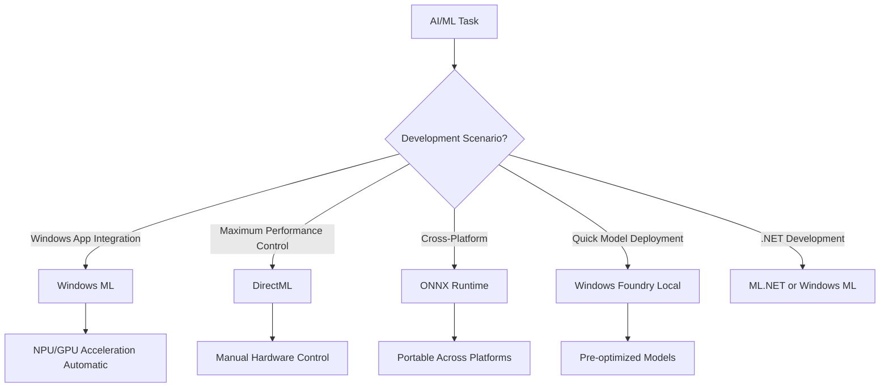
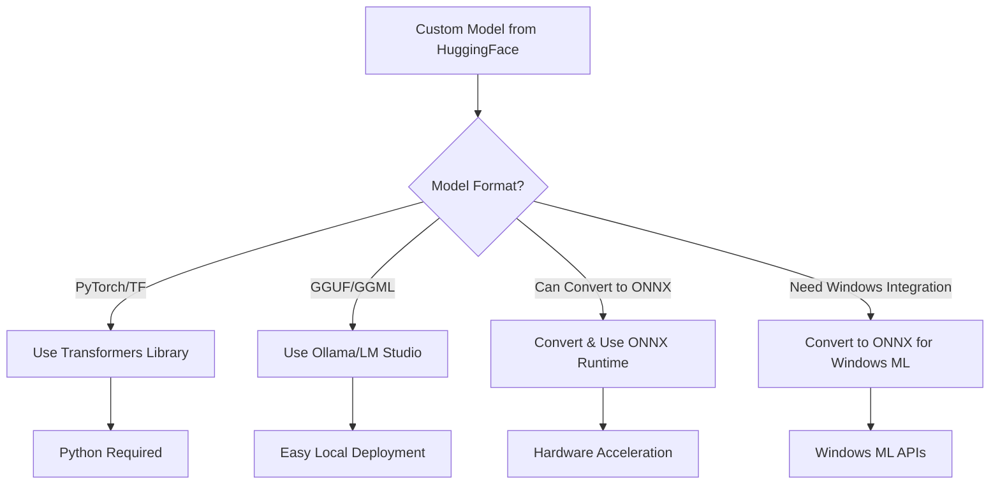

# Windows AI Stack Explained: Complete Architecture Guide

## Executive Summary

The Windows AI ecosystem consists of multiple layers working together to provide AI capabilities from high-level APIs to low-level hardware acceleration. This document clarifies the relationships between Windows ML, ONNX Runtime, DirectML, and the local Windows AI stack. It also distinguishes between Windows AI Foundry (local/on-device) and Azure AI Foundry (cloud).

**Last Updated**: August 2025

## Architecture Overview

### Local (On-Device) Stack

```
┌─────────────────────────────────────────┐
│     Windows AI Foundry (Local)          │ ← On-device AI platform (Windows 11)
├─────────────────────────────────────────┤
│     Windows Copilot Runtime             │ ← AI runtime for Copilot+ PCs
│  (Copilot Library APIs + 40+ models)    │   (Only on Copilot+ PCs)
├─────────────────────────────────────────┤
│        Foundry Local                    │ ← Local model catalog & deployment
├─────────────────────────────────────────┤
│           Windows ML APIs               │ ← High-Level APIs (App integration)
├─────────────────────────────────────────┤
│          ONNX Runtime (ORT)             │ ← Inference Engine (Cross-platform)
├─────────────────────────────────────────┤
│       Execution Providers (EPs)         │ ← Hardware Interface Layer
├─────────────────────────────────────────┤
│  DirectML | CUDA | TensorRT | NPU EPs   │ ← Hardware Acceleration
├─────────────────────────────────────────┤
│    Hardware (CPU, GPU, NPU, etc.)       │ ← Physical Layer
└─────────────────────────────────────────┘
```

### Cloud Stack (Separate)

```
┌─────────────────────────────────────────┐
│      Azure AI Foundry (Cloud)           │ ← Cloud AI platform (Azure)
├─────────────────────────────────────────┤
│   Model Hub | Training | Deployment     │ ← Cloud services
├─────────────────────────────────────────┤
│      Azure Infrastructure               │ ← Azure compute/storage
└─────────────────────────────────────────┘
```

## Layer-by-Layer Breakdown

### 1. Windows AI Foundry (Local/On-Device Platform)

- **Status**: General Availability (GA) - Integrated into Windows 11
- **Purpose**: On-device AI platform for local inference and development on Windows
- **Location**: Runs locally on Windows 11 devices
- **Key Features**:
  - Local AI model execution without cloud dependency
  - Secure, low-latency inferencing on-device
  - Deep integration with Windows 11 24H2+ and Copilot+ PCs
  - Built-in NPU optimization for Qualcomm, Intel, AMD hardware
  - Integrates Foundry Local for model catalog access
  - Privacy-preserving (data never leaves device)

### 1b. Azure AI Foundry (Cloud Platform - Separate Product)

- **Status**: General Availability (GA) as of Q2 2025
- **Purpose**: Cloud-based AI platform for enterprise AI operations
- **Location**: Runs in Azure cloud
- **Key Features**:
  - Model discovery and catalog browsing (OpenAI, Cohere, Black Forest Labs)
  - Advanced fine-tuning with pause/resume and cross-region copying
  - Reinforcement Fine Tuning (RFT) with REST API support
  - Cloud deployment orchestration with pay-as-you-go or PTU options
  - Team collaboration and enterprise governance
  - Scalable training and inference infrastructure

### 2. Windows Copilot Runtime (Copilot+ PC AI Platform)

- **Status**: Preview/Rolling out (Announced May 2024)
- **Purpose**: System-level AI runtime for Copilot+ PC experiences
- **Availability**: **ONLY on Copilot+ PCs** (Snapdragon X, Intel Lunar Lake, AMD Zen 5)
- **Key Components**:
  - **Windows Copilot Library**: Set of APIs for AI features
  - **40+ on-device AI models**: Including Phi Silica and other SLMs
  - **Integrated frameworks**: ONNX Runtime, DirectML coordination
  - **System AI features**: Recall, Windows Semantic Index, Live Captions
- **Developer Access**: Direct API access through Copilot Library
- **Relationship to Stack**:
  - Sits above Windows ML/ONNX Runtime
  - Provides higher-level abstraction for AI features
  - Orchestrates access to NPUs and AI models
- **Use Case**: Building advanced AI features on Copilot+ PCs

**Important**: Windows Copilot Runtime is NOT available on regular Windows PCs - it requires Copilot+ PC hardware with NPUs.

### 3. Foundry Local (Local Model Management)

- **Status**: GA - Component of Windows AI Foundry
- **Purpose**: Brings open-source models to edge/local devices
- **Location**: Runs locally, integrated into Windows AI Foundry
- **Key Features**:
  - Ready-to-use model catalog for local execution
  - Integration with Ollama, NVIDIA NIMs
  - Automatic hardware optimization
  - Privacy-preserving local execution
  - No cloud connectivity required
- **Use Case**: Quick deployment of curated models locally without cloud dependencies

The Relationship:

Foundry Local is a component that is integrated INTO Windows AI Foundry, not a separate product.

Think of it this way:

- Windows AI Foundry = The overall local AI platform for Windows 11
- Foundry Local = The model catalog/deployment component within Windows AI Foundry

From the Microsoft documentation: "Windows AI Foundry uses Foundry Local to enable on-device inferencing and
local development"

So the stack is:
Windows AI Foundry (the platform)
    └── Contains Foundry Local (the model catalog component)
        └── Which provides local models
            └── That run on Windows ML → ONNX Runtime → DirectML

It's like saying:

- Windows has File Explorer
- File Explorer is part of Windows, not separate

Similarly:

- Windows AI Foundry has Foundry Local
- Foundry Local is part of Windows AI Foundry

The confusion comes from Microsoft sometimes referring to "Foundry Local" as if it's a standalone thing, but
it's actually the model management component within the Windows AI Foundry platform.

### 4. Windows ML (High-Level APIs)

- **Status**: GA (Active Development)
- **Purpose**: Primary API for integrating ML into Windows apps
- **Key Points**:
  - **NOT deprecated** - actively developed and recommended
  - Now powered by ONNX Runtime internally (since 2024)
  - Supports CPU, GPU, and NPU acceleration
  - Available for UWP, WinRT, and Desktop apps
  - Two versions exist:
    - Legacy APIs (2018): Ships with Windows, simple but limited
    - Modern APIs (2024+): Part of Windows App SDK, more features
- **Languages**: C++, C#, JavaScript
- **Use Case**: Standard Windows app development with ML features

**Important Clarification**: There is NO official deprecation of Windows ML APIs as of 2025. Windows ML remains the recommended high-level API for Windows applications needing local AI inference. Any references to "unified Foundry APIs" replacing Windows ML are unsubstantiated.

### 5. ONNX Runtime (Inference Engine)

- **Status**: GA (Mature)
- **Purpose**: Cross-platform ML inference engine
- **Key Features**:
  - Core engine behind Windows ML
  - Direct SDK usage available
  - Broad model format support
  - Cross-platform (Windows, Linux, macOS, mobile)
- **Languages**: Python, C++, C#, Java, JavaScript
- **Use Case**: Maximum portability and flexibility

### 6. Execution Providers (Hardware Interface)

- **Purpose**: Bridge between ONNX Runtime and hardware
- **Types**:
  - CPU ExecutionProvider (default)
  - DirectML ExecutionProvider (Windows GPU/NPU)
  - CUDA ExecutionProvider (NVIDIA)
  - TensorRT ExecutionProvider (NVIDIA optimized)
  - OpenVINO ExecutionProvider (Intel)
  - Custom NPU providers (Qualcomm, AMD, Intel)

### 7. DirectML (Low-Level Acceleration)

- **Status**: GA (Mature)
- **Purpose**: Low-level hardware acceleration API
- **Key Features**:
  - Direct GPU/NPU access
  - Maximum performance control
  - DirectX-style programming model
- **Language**: C++ primarily
- **Use Case**: Games, real-time rendering, custom ML pipelines

## Decision Tree: Which Technology to Use?



## Practical Scenarios and Recommendations

### Scenario 1: Building a Windows Desktop App with AI

**Recommended Stack**: Windows ML + Windows Foundry Local

- Use Windows ML APIs for inference
- Deploy models via Foundry Local catalog
- Automatic NPU/GPU acceleration

### Scenario 2: Game or Real-time Application

**Recommended Stack**: DirectML

- Direct hardware control
- Minimal overhead
- Custom optimization possible

### Scenario 3: Cross-platform AI Service

**Recommended Stack**: ONNX Runtime directly

- Use ORT SDK directly
- Deploy same code on Windows/Linux/Cloud
- Manual EP configuration

## When to Use ONNX Runtime Directly in Windows Applications

### Primary Use Cases for Direct ONNX Runtime

#### 1. **Cross-Platform Requirements**

When your application needs to run on multiple operating systems:

```csharp
// Same code works on Windows, Linux, macOS, mobile
using var session = new InferenceSession("model.onnx");
// Deploy identical code everywhere
```

#### 2. **Maximum Control Over Execution Providers**

Fine-grained control over hardware selection and fallback chains:

```csharp
var sessionOptions = new SessionOptions();
// Explicitly configure provider priority and options
sessionOptions.AppendExecutionProvider_CUDA(cudaOptions);
sessionOptions.AppendExecutionProvider_TensorRT(trtOptions);
sessionOptions.AppendExecutionProvider_DirectML(dmlOptions);
sessionOptions.AppendExecutionProvider_CPU(cpuOptions);
```

#### 3. **Python Development**

Python developers typically use ONNX Runtime directly:

```python
import onnxruntime as ort
import numpy as np

session = ort.InferenceSession("model.onnx")
inputs = {"input": np.array([[1.0, 2.0, 3.0]], dtype=np.float32)}
outputs = session.run(None, inputs)
```

#### 4. **Advanced Model Operations**

When you need features like:

- Runtime model quantization
- Dynamic graph modifications
- Custom operators
- Training (not just inference)
- IOBinding for zero-copy operations
- Custom thread pools
- Profiling APIs

#### 5. **Server/Cloud Scenarios**

Building containerized services or cloud functions:

```python
# Docker container or Azure Function
import onnxruntime as ort
session = ort.InferenceSession("model.onnx")
# No Windows-specific dependencies
```

#### 6. **Minimal Dependencies**

When you want the smallest deployment without Windows-specific dependencies:

```csharp
// Just need Microsoft.ML.OnnxRuntime NuGet package
// No Windows App SDK required
var session = new InferenceSession("model.onnx");
```

### When NOT to Use ONNX Runtime Directly

Stick with **Windows ML** when:

- Building Windows-only applications
- Want automatic NPU/GPU selection for Copilot+ PCs
- Need simplified API with less boilerplate
- Want integration with Windows AI Foundry
- Building UWP or Windows App SDK apps

### Code Comparison

**Windows ML (Simplified)**:

```csharp
// Automatic hardware selection, Windows-optimized
var model = LearningModel.LoadFromFilePath("model.onnx");
var device = LearningModelDevice(LearningModelDeviceKind.DirectXHighPerformance);
var session = new LearningModelSession(model, device);
```

**ONNX Runtime (More Control)**:

```csharp
// Manual configuration, cross-platform
var sessionOptions = new SessionOptions();
sessionOptions.GraphOptimizationLevel = GraphOptimizationLevel.ORT_ENABLE_ALL;
sessionOptions.ExecutionMode = ExecutionMode.ORT_PARALLEL;
sessionOptions.AppendExecutionProvider_DirectML(deviceId);
var session = new InferenceSession("model.onnx", sessionOptions);
```

### Decision Matrix

| Scenario | Use ONNX Runtime | Use Windows ML |
|----------|-----------------|----------------|
| Windows-only app | ❌ | ✅ |
| Cross-platform | ✅ | ❌ |
| Python development | ✅ | ❌ |
| NPU auto-selection | ❌ | ✅ |
| Custom providers | ✅ | ❌ |
| Simple integration | ❌ | ✅ |
| Maximum control | ✅ | ❌ |
| Container/Cloud | ✅ | ❌ |

### Scenario 4: Copilot+ PC Features

**Recommended Stack**: Windows AI Foundry (Local) APIs

- Ready-to-use language and vision models
- NPU-optimized out of the box
- Privacy-preserving local execution

## Using Models Outside the Foundry Catalog

### What If My Model Isn't in Foundry Local?

Windows Foundry Local provides a curated catalog, but you have many options for using models from Hugging Face or other sources:

### Option 1: Direct Hugging Face Usage (Python)

```python
# Install: pip install transformers torch
from transformers import AutoModel, AutoTokenizer

model = AutoModel.from_pretrained("bert-base-uncased")
tokenizer = AutoTokenizer.from_pretrained("bert-base-uncased")
# Run inference directly
```

**Pros**: Full Hugging Face ecosystem access
**Cons**: Requires Python, may not use NPU optimally

### Option 2: Convert to ONNX for Windows ML/ONNX Runtime

```bash
# Install: pip install optimum[onnxruntime]
optimum-cli export onnx --model facebook/opt-125m output_dir/

# Then use with ONNX Runtime or Windows ML
```

**Pros**: Hardware acceleration via DirectML, works with Windows ML
**Cons**: Not all models convert cleanly, especially newer architectures

### Option 3: Alternative Local Inference Tools

| Tool | Formats | Windows Support | GUI | Use Case |
|------|---------|-----------------|-----|----------|
| **Ollama** | GGUF, GGML | ✅ Excellent | CLI + API | LLMs, simple deployment |
| **LM Studio** | GGUF, GGML | ✅ Excellent | Full GUI | User-friendly, no coding |
| **llama.cpp** | GGUF | ✅ Good | CLI | Maximum performance |
| **Text Generation WebUI** | Multiple | ✅ Good | Web UI | Experimentation |

### Option 4: Direct ONNX Runtime Integration

```csharp
// For C# developers - bypass Windows ML entirely
using Microsoft.ML.OnnxRuntime;

var session = new InferenceSession("your-model.onnx");
// Configure execution providers manually
```

**Pros**: Full control, cross-platform
**Cons**: More complex than Windows ML

### Decision Tree for Custom Models



### Limitations When Bypassing Foundry

1. **No Automatic NPU Optimization**: Foundry models are pre-optimized for NPUs
2. **Manual Dependency Management**: You handle all requirements
3. **No Integrated Updates**: Must manually update models
4. **Variable Performance**: May not achieve optimal hardware utilization
5. **Security Considerations**: Verify model sources and licenses

### Best Practices for Custom Models

1. **For Production Windows Apps**: Convert to ONNX, use Windows ML
2. **For Experimentation**: Use Ollama or LM Studio
3. **For Python Development**: Use Hugging Face Transformers directly
4. **For Cross-Platform**: Use ONNX Runtime directly
5. **For LLMs**: Consider GGUF format with Ollama

### Can You Add Models to Foundry Local?

**Currently NO** - Foundry Local does not support adding custom models to its catalog (as of 2025). You must use one of the alternatives above.

## NPU and Copilot+ PC Support

### Hardware Partners

- **Qualcomm**: Snapdragon X Elite/Plus
- **AMD**: Ryzen AI (Ryzen 7040/8040 series)
- **Intel**: Core Ultra (Meteor Lake and newer)
- **NVIDIA**: RTX GPUs with Tensor Cores

### Automatic Acceleration

Windows ML and ONNX Runtime automatically detect and use:

1. NPU when available (40+ TOPS on Copilot+ PCs)
2. GPU as fallback
3. CPU as final fallback

## API Clarification: What's Actually Happening

### Windows ML Status (As of August 2025)

**Windows ML is NOT being deprecated.** This needs to be absolutely clear. Here's the actual situation:

1. **Windows ML remains the primary high-level API** for Windows applications doing local AI inference
2. **No official deprecation announcements** exist from Microsoft regarding Windows ML
3. **Windows AI Foundry does NOT replace Windows ML** - it's a platform layer that Windows ML runs on top of

### The API Landscape

| API/Platform | Purpose | Status | When to Use |
|--------------|---------|--------|-------------|
| **Windows ML** | High-level inference API | Active, Recommended | Windows apps needing local AI |
| **ONNX Runtime** | Cross-platform inference | Active, Recommended | Cross-platform or advanced scenarios |
| **DirectML** | Low-level GPU/NPU access | Active | Games, custom pipelines |
| **Windows AI Foundry** | Platform/infrastructure | Active | Not an API - it's the platform |
| **Foundry Local** | Model catalog | Active | Part of Windows AI Foundry |

### What About "Unified Foundry APIs"?

There is **no documented "unified Foundry API"** that replaces Windows ML. This appears to be a misunderstanding. What actually exists:

- **Windows AI Foundry** is a platform, not an API
- **Foundry Local** provides model management, not inference APIs
- **Windows ML** continues to be the primary inference API for all Windows devices
- **Windows Copilot Runtime** provides additional APIs (Copilot Library) but ONLY for Copilot+ PCs

### Understanding Windows Copilot Runtime vs Windows ML

| Aspect | Windows ML | Windows Copilot Runtime |
|--------|-----------|-------------------------|
| **Availability** | All Windows devices | ONLY Copilot+ PCs |
| **Purpose** | General ML inference | Advanced AI experiences |
| **APIs** | LearningModel, etc. | Copilot Library APIs |
| **Models** | Bring your own ONNX | 40+ built-in models |
| **Status** | GA, mature | Preview, rolling out |
| **NPU Required** | No (but can use it) | Yes (Copilot+ PC only) |

### The Real Architecture

```
Application Code
    ↓
Windows ML APIs (or direct ONNX Runtime)
    ↓
ONNX Runtime Engine
    ↓
Execution Providers (DirectML, CUDA, etc.)
    ↓
Hardware

Windows AI Foundry wraps around this stack for model management
```

## Common Misconceptions Clarified

### ❌ Myth: "Windows ML is deprecated or being replaced by Foundry APIs"

✅ **Reality**: Windows ML is actively developed and is the recommended API for Windows apps. It was rearchitected to use ONNX Runtime internally. There is NO official deprecation announcement from Microsoft. Windows ML continues to be the primary high-level API for local AI inference on Windows.

### ❌ Myth: "DirectML replaces Windows ML"

✅ **Reality**: DirectML is a lower-level API. Windows ML uses DirectML through ONNX Runtime for hardware acceleration.

### ❌ Myth: "You must choose between technologies"

✅ **Reality**: These technologies work together. Windows ML uses ONNX Runtime, which uses DirectML for GPU acceleration.

## Version and Release Information

| Technology | Latest Version | Release Status | Last Major Update |
|------------|---------------|----------------|-------------------|
| Windows ML | Windows 11 23H2+ | GA | Build 2024 |
| ONNX Runtime | 1.17+ | GA | Continuous |
| DirectML | 1.13+ | GA | 2024 |
| Windows AI Foundry | GA | General Availability | Windows 11 |
| Azure AI Foundry (Cloud) | GA | General Availability | Q2 2025 |
| Foundry Local | GA | General Availability | 2025 |

## Migration Guide

### From Legacy Windows ML (pre-2024)

1. Update to latest Windows SDK
2. Windows ML now uses ONNX Runtime internally
3. No API changes required for basic scenarios
4. Consider Windows Foundry for model management

### From DirectML Only

1. Consider Windows ML for easier integration
2. DirectML still supported for low-level control
3. Can use both together in same application

### From Pure ONNX Runtime

1. Windows ML provides Windows-specific optimizations
2. Continue using ORT for cross-platform scenarios
3. Windows Foundry Local for model catalog access

## Best Practices

1. **Start with Windows ML** for Windows-specific applications
2. **Use Windows Foundry Local** for quick model deployment
3. **Drop to DirectML** only when you need precise hardware control
4. **Use ONNX Runtime directly** for cross-platform requirements
5. **Leverage NPU acceleration** automatically through Windows ML
6. **Test on Copilot+ PCs** for optimal AI performance

## Recent Updates (2025)

### August 2025 Enhancements

- Pause & resume for fine-tuning jobs (extended to all model types)
- Cross-region model copying for disaster recovery
- Reinforcement Fine Tuning (RFT) with Swagger/API support
- FLUX.1 image generation models added to catalog (Black Forest Labs)

### Platform Changes

- Windows Copilot Runtime introduced as AI platform for Copilot+ PCs (May 2024)
  - Provides Windows Copilot Library APIs
  - Includes 40+ on-device AI models
  - ONLY available on Copilot+ PC hardware with NPUs
  - NOT a replacement for Windows ML - it's an additional layer for advanced AI
- Unified model pipeline for client and cloud deployments
- Enhanced NPU support across Qualcomm, Intel, and AMD hardware

## Future Roadmap (Beyond 2025)

- Continued expansion of model catalog partnerships
- Enhanced enterprise governance and compliance features
- Further NPU optimization and hardware acceleration
- Tighter Visual Studio and development tool integration

## Resources and Documentation

- [Windows ML Documentation](https://learn.microsoft.com/windows/ai/windows-ml/)
- [ONNX Runtime Documentation](https://onnxruntime.ai/)
- [DirectML Documentation](https://learn.microsoft.com/windows/ai/directml/)
- [Windows AI Foundry](https://learn.microsoft.com/windows/ai/foundry/)
- [Build 2024 Announcements](https://blogs.windows.com/windowsdeveloper/)

## Related Documentation

For detailed information on specific technologies:

- [Windows Foundry Local Guide](foundry_local.md) - Comprehensive guide on local model deployment
- [ONNX Runtime Guide](onnx_runtime.md) - Deep dive into ONNX Runtime usage on Windows
- [Windows ML Evolution](windows_ml.md) - Detailed comparison of legacy vs modern Windows ML

## Summary

The Windows AI stack is a **layered architecture** where each component has a specific role:

**Local/On-Device Stack:**

- **Windows AI Foundry**: Local AI platform integrated into Windows 11 (provides infrastructure)
- **Foundry Local**: Local model catalog and deployment (part of Windows AI Foundry)
- **Windows ML**: High-level API for app developers (NOT deprecated, remains the primary API)
- **ONNX Runtime**: Core inference engine (can be used directly for more control)
- **DirectML**: Low-level hardware acceleration

**Cloud Stack (Separate):**

- **Azure AI Foundry**: Cloud-based AI platform for enterprise operations

**Key Distinction**: Windows AI Foundry is for local/on-device AI on Windows, while Azure AI Foundry is a separate cloud service on Azure. They are complementary but distinct products.

For most developers building Windows desktop apps with local AI, **Windows ML with Foundry Local** provides the best balance of ease-of-use and performance. The entire local stack is actively developed and optimized for the latest hardware including NPUs in Copilot+ PCs.


## Related Concepts

### Related Topics

- [[windows_ml]] - Detailed exploration of Windows ML component

### Extended By

- [[windows_ml]] - Deep dive into specific Windows ML layer